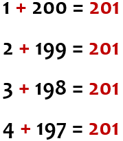

In this exercise, we will see how computational thinking can be used to add up all the numbers between 1 and 200 in our heads, i.e. `1 + 2 + 3 + 4` and so on. We should be able to do this in less than a minute. 

Seems impossible?

It's not.

Using the first computational thinking step - *Decomposition* - we break the problem up into smaller pieces. Rather than trying to add the numbers up sequentially, which would be challenging for many people to do in their heads, let's approach the task in a different way.

::::::::: challenge

## Decomposition

Let's begin at each end of the 1-200 sequence by adding up the first and last numbers.

What is `200 + 1`? 

:::::::: solution
The answer is `201`.
:::::::

Let's now add up the second and the second last numbers, i.e. `199 + 2`. 

:::::::: solution
The answer is `201`.
:::::::

Let's now add up the third and the third last numbers, i.e. `198 + 3`. 

:::::::: solution
The answer is `201`.
:::::::

:::::::::

-------

### Pattern recognition

Using our second step - *Pattern recognition* - we should be able to spot a clear pattern, i.e. that each pair of numbers appears to add up to `201`.

{alt="Spotting a pattern" width="25%"}

If we follow this same process with **all** the numbers between 1 and 200, we will end up with **100 pairs**, each of which will add up to `201`.

-------

### Algorithm

Using an *Algorithm* - another name for a series of steps - how do we calculate the final total?

We multiply the `number of pairs` (100) by `201` (the total to which each pair adds up).

`100 * 201` gives us the answer of `20,100`.

So far, so good.

Now, what about about our fourth step, *Abstraction*? 

-------

### Abstraction 

*Abstraction* will enable us to generalise from that experience, i.e. repeat the process we used to add up all the numbers between 1 and 200 to add up a *different* set of numbers, e.g., 1-500.

The *Algorithm* will be 

(`number to be added` divided by 2) multiplied by (`number to be added` +1). We can express that as an algebraic formula:

`(x/2) * (x + 1)`

where *`x`* is the `number to be added`.

-------------

That's it! Using those four key steps, we have learned the basics of computational thinking.

---------

:::challenge
## Practice

Use the algorithm above to add up all the numbers between 1 and 24, 1 and 50, and 1 and 1,000.
:::

:::: discussion

## Discussion

The numbers above are all even numbers. What would be the process for adding up numbers if the final number is an odd one, e.g., 17? Can you use the same formula? If not, what adaptations would you need to make to the formula?
:::
